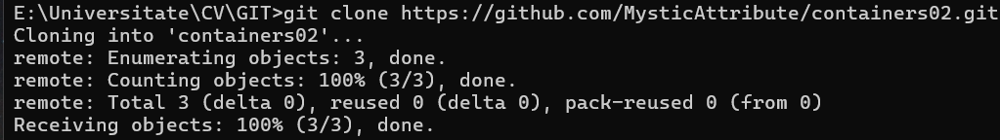
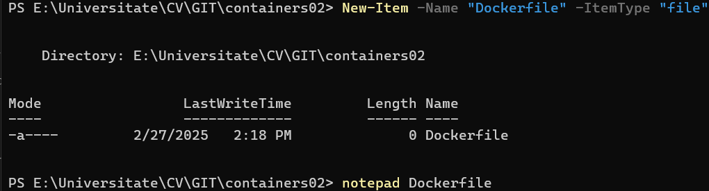
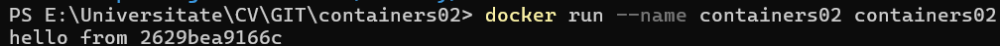
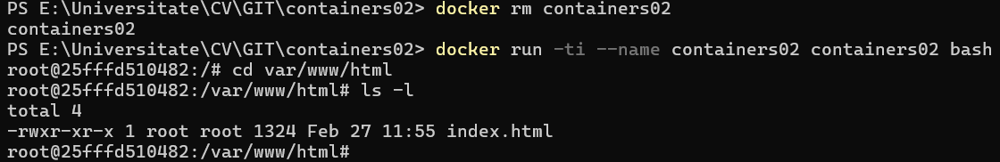

# Prima aplicatie Docker

## Scopul: Familiarizarea cu elementele de baza containerizarii

### Sarcina propusa: Instalarea aplicatiei Docker Desktop si verificarea functionarii acestuia

### Mod de lucru

1. Descarcam si instalam [Docker Desktop](https://www.docker.com/products/docker-desktop/) in conformitate cu sistemul de operare utilizat de noi
2. In directorul nostru de lucru (in cazul meu repozitoriul nou creat si copiat) cream un fisier fara extensie cu urmatorul continut

```shell
FROM debian:latest
COPY ./site/ /var/www/html/
CMD ["sh", "-c", "echo hello from $HOSTNAME"]
```

3.Rulam comanda

```shell
docker build -t containers02 .
```

Crearea imaginii a durat aprocimativ 2 minute.



**Remarca:** In caz ca nu putem crea un fisier fara extensie prin notepad sau VS Code(mediul de lucru al dvs.) sunt doua cai de a rezolva

- Putem crea un fisier fara extensie prin Powershell/CMD in urmatorul mod 

Apoi adaugam prin notepad continutul si salvam (Ctrl + S)

- Putem specifica in comanda din punctul 3 extensia fisierului si comanda va arata astfel

```shell
docker build -t containers02 -f Dockerfile.extensie .
```

4.Pornim containerul prin comanda data

```shell
docker run --name containers02 containers02
```



Mesajul indica faptul ca Docker a reusit sa creeze si sa ruleze un nou container bazat pe imaginea containers02, iar numele „2629bea9166c”, care este un ID generat pentru containerul meu obtinut din variabila $HOSTNAME
5.Stergem containerul si il pornim din nou utilizand comenzile

```shell
docker rm containers02
docker run -ti --name containers02 containers02 bash
```

Apoi in fereastra deschisa obtinuta vom utiliza comenzile urmatoare

```shell
cd /var/www/html/
ls -l
```



In rezultatul executiei avem urmatoarea informatie obtinuta

- *-rwxr-xr-x:* Permisiunile fisierului indica ca fisierul este citit, scris si executat de utilizatorul root, si citit si executat de grup si ceilalti utilizatori.
- *1 root root:* Fisierul apartine utilizatorului root și grupului root.

## Concluzie

In urma efectuarii lucrarii de laborator am invatat cum sa cream un container si o imagine folosind aplicatia Docker si am invatat cum se creeaza fisierele dockerfile si cateva comenzi simple care pot contine asa tip de fisiere. In final am verificat ca in */var/www/html/* a fost copiat fisierul *index.html* care a fost creat de noi in directorul *site*

### Bibliografie

- [Docker Official Website](https://www.docker.com/)
